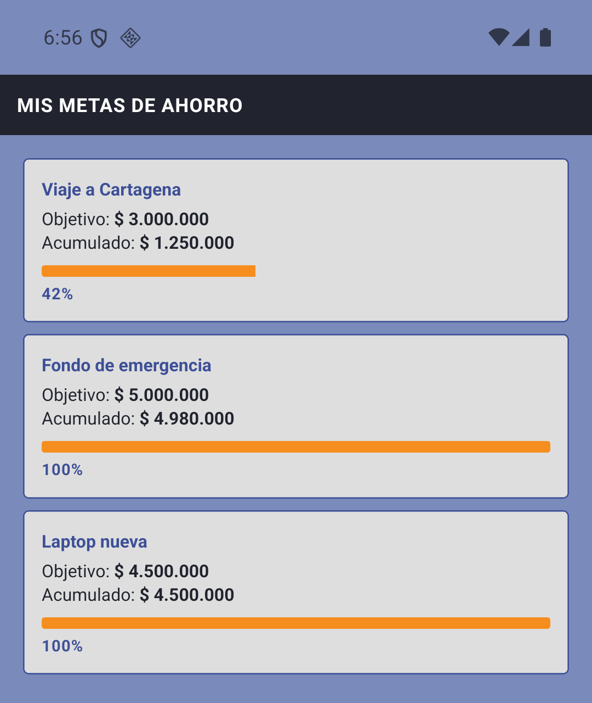
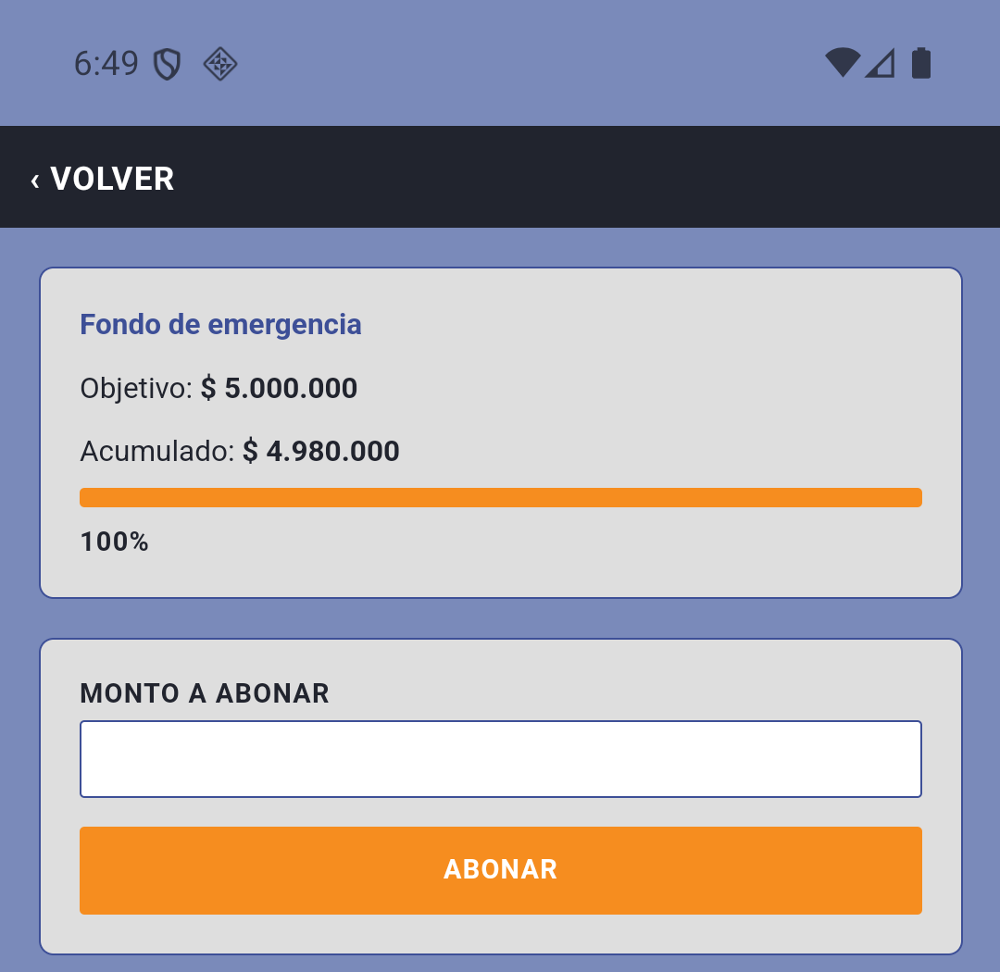
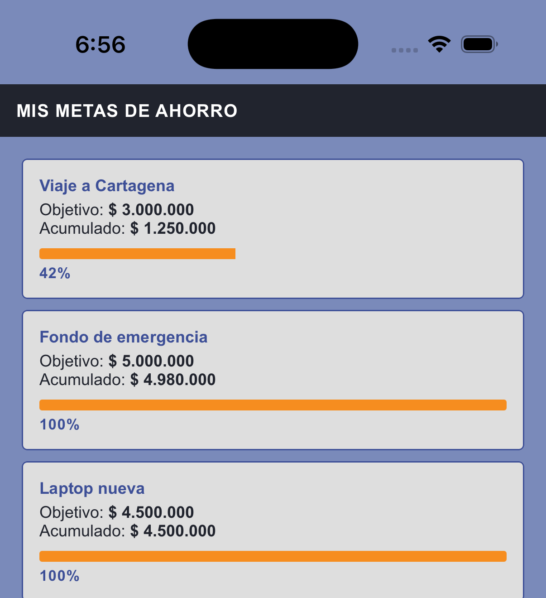
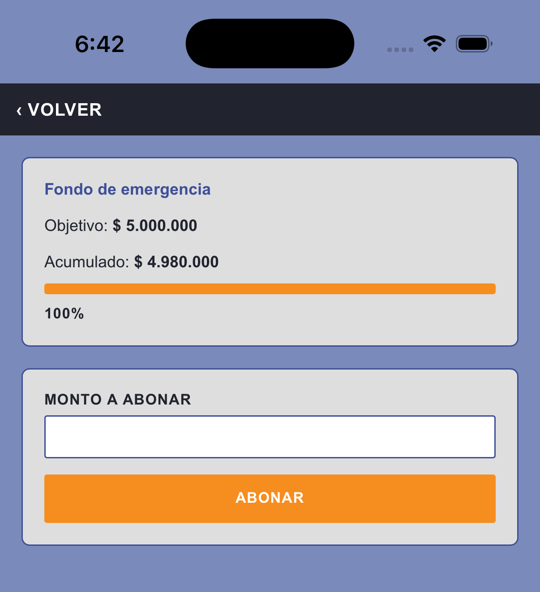
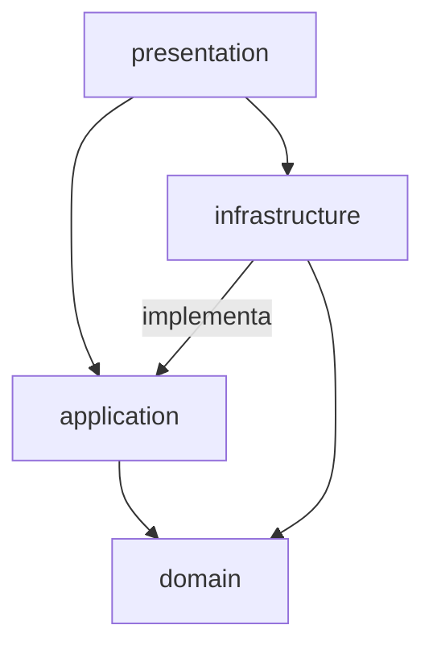

# Bolsillo de Ahorro Programado

KATA Senior React Native Mobile Engineer — Grupo Bolívar.

## Descripción

Feature "Bolsillo de Ahorro Programado": una pantalla nativa lista las metas de ahorro del usuario con su progreso (HU1); tocar una meta abre su detalle y un formulario de abono renderizados por una micro-app web dentro de un `WebView` (HU2); al confirmar un abono válido, la app nativa recibe el mensaje, actualiza Redux y refleja el nuevo acumulado sin recargar la vista (HU3); si ese abono completa la meta, se dispara un diálogo de confirmación nativo del sistema y una notificación local, ambos vía `rn-savings-notifier` (HU4). Las cuatro HUs del examen están implementadas.

## Estructura del repositorio

- `web/` — micro-app web (detalle de meta + abono), renderizada en WebView.
- `libreria/` — `rn-savings-notifier`, librería nativa (TurboModule Swift + Kotlin) con diálogo de confirmación, notificaciones locales y actualización en tiempo real de cantidad acumulada en WebView.
- `mobile/` — app React Native.

## Requisitos y versiones

- Node 25.9.0
- React Native 0.87.0, React 19.2.3
- iOS: Xcode 26.5, CocoaPods 1.16.2
- Android: SDK 37 / build-tools 37.0.0, NDK 27.1.12297006, Kotlin 2.2.0, Java 17

## Instalación y ejecución

### iOS

```sh
cd mobile
npm install
bundle install && bundle exec pod install --project-directory=ios
npm run ios
```

### Android

```sh
cd mobile
npm install
npm run android
```

Requiere un emulador o dispositivo Android corriendo (`adb devices` debe listarlo), Java 17 y el SDK de Android configurado (`ANDROID_HOME`). `rn-savings-notifier` trae su implementación Kotlin; el autolinking la detecta sola, sin pasos manuales.

## Demo

Las 4 HUs (listado con progreso, detalle + abono en WebView, diálogo de
confirmación, actualización sin recargar) corriendo en `mobile/` sobre
simulador/emulador real:

<p align="center">
  
  
</p>

> ¿Prefieres video? [Android (MP4)](mobile/docs/media/demo-android.mp4) ·
> [iOS (MP4)](mobile/docs/media/demo-ios.mp4)

| | Listado | Detalle / abono |
|---|---|---|
| **Android** |  |  |
| **iOS** |  |  |

## Arquitectura

`mobile/src/` sigue DDD ligero en cuatro capas. La flecha va del que depende al que provee — el dominio no depende de nada:



- **`domain/`** — reglas puras (dinero, progreso, transición de meta cumplida). Sin imports de React, React Native ni Redux; lo aplica el lint del proyecto, no solo la convención.
- **`application/`** — casos de uso (`GetGoals`, `ConfirmDeposit`) y el puerto `SavingsGoalRepository`. Depende solo del dominio.
- **`infrastructure/`** — implementaciones del puerto (`ReduxSavingsGoalRepository` en la app, `InMemorySavingsGoalRepository` en tests), el store de Redux y el contrato `postMessage` (`webMessages.ts`).
- **`presentation/`** — pantallas y hooks. Compone el caso de uso con la implementación concreta del repositorio (por ejemplo `useGoals`) y es la única capa que importa `rn-savings-notifier`.

`libreria/rn-savings-notifier` es un paquete aparte, sin dependencia del árbol anterior: expone dos funciones (`showConfirmDialog`, `notifyGoalCompleted`) que `mobile/` consume como cualquier dependencia de npm. El contrato `postMessage` incluye además `ACCUMULATED_AMOUNT_UPDATED` para que la micro-app actualice su interfaz en tiempo real sin remontaje del `WebView`. `web/` es HTML/JS estático sin capas, embebido en el `WebView` y comunicado por ese contrato documentado más abajo.

## Patrones de diseño

### Repository

- **Problema**: los casos de uso necesitan leer y escribir metas de ahorro sin saber si el dato vive en Redux, en memoria (tests) o en un backend futuro.
- **Dónde**: `SavingsGoalRepository` (`mobile/src/application/savingsGoalRepository.ts`) es un puerto — interfaz con `findAll`/`findById`/`save`, sin implementación. `GetGoals` y `ConfirmDeposit` dependen solo de esa interfaz.
- **Alternativa descartada**: llamar a `useSelector`/`dispatch` directamente desde los casos de uso. Más corto, pero acopla `application/` a Redux y hace imposible probar los casos de uso sin un store real.
- **Trade-off aceptado**: una capa de indirección (la interfaz) a cambio de que la implementación de test (`InMemorySavingsGoalRepository`) y la de producción (`ReduxSavingsGoalRepository`) sean intercambiables sin tocar `application/`.

### Adapter

- **Problema**: el puerto `SavingsGoalRepository` espera `findAll`/`findById`/`save`; Redux expone `getState()`/`dispatch()`, una API distinta.
- **Dónde**: `ReduxSavingsGoalRepository` (`mobile/src/infrastructure/`) adapta el store de Redux a la interfaz del puerto, traduciendo cada método a un `getState()` + selector o a un `dispatch()`.
- **Alternativa descartada**: que las pantallas llamen `useSelector`/`dispatch` sin adaptador. Funciona, pero mezcla vocabulario de Redux con el de los casos de uso en cada componente.
- **Trade-off aceptado**: una clase más a cambio de poder reemplazar Redux (por ejemplo por Context o Zustand) sin tocar `domain/` ni `application/`.

### Observer / Pub-Sub

- **Problema**: `GoalsScreen` debe re-renderizar cuando cualquier meta cambia (por ejemplo, tras un abono hecho desde el detalle); `GoalDetailScreen` no gana nada re-renderizando, porque después del montaje no pinta nada derivado de la meta — eso lo hace la micro-app dentro del `WebView`.
- **Dónde**: `useGoals` se suscribe al store con `useSelector(selectGoals)` — el componente se registra y Redux lo notifica en cada cambio (observer). `useGoalSnapshot` y `useConfirmDeposit` leen o escriben una sola vez con `useStore().getState()`/`dispatch()`, sin suscripción.
- **Alternativa descartada**: suscribir también el detalle, o pasarle la meta por props en lugar de leerla del store. Lo primero lo re-renderiza en cada abono sin efecto observable; lo segundo duplica el estado de la meta en dos sitios.
- **Trade-off aceptado**: dos hooks con la misma forma de acceso pero comportamiento de suscripción distinto — hay que leer el comentario de cada uno para saber cuál es cuál — a cambio de que cada pantalla re-renderice exactamente cuando debe y ni una vez más.
- **Lo que esta decisión *no* hace**: no es lo que impide que el `WebView` recargue. Un re-render con un `source` de identidad estable ni lo remonta ni lo recarga; lo que protege la sesión de la micro-app es que `source` sea una constante de módulo, y eso lo fija `webViewStability.test.tsx`. Se documenta porque la versión anterior de este README afirmaba lo contrario, y era falso.

## Contrato de mensajes (postMessage)

Definido en `mobile/src/infrastructure/webMessages.ts` como uniones discriminadas — único módulo con esta forma en el lado nativo. `web/index.html` no tiene sistema de módulos (HTML/JS estático), así que replica estos strings `type` a mano; se mantienen sincronizados por convención y por este catálogo.

**Web → nativo (`WebToNativeMessage`)**

| `type` | payload | Cuándo |
|---|---|---|
| `WEB_APP_READY` | — | La micro-app registró su listener de mensajes y anuncia que está lista. |
| `DEPOSIT_CONFIRMED` | `{ goalId: string; amount: number }` | El usuario confirmó un abono válido en el formulario. |

**Nativo → web (`NativeToWebMessage`)**

| `type` | payload | Cuándo |
|---|---|---|
| `SESSION_INITIALIZED` | `{ sessionId: string; userInfo: { name: string }; goal: SavingsGoal }` | Respuesta al `WEB_APP_READY`, nunca antes. |
| `ACCUMULATED_AMOUNT_UPDATED` | `{ accumulatedAmount: number }` | Después de confirmar un abono válido, para que la micro-app actualice su UI sin remontarse. |

`WEB_APP_READY` no está en el ejemplo del examen: se agregó porque responder en `onLoadEnd` es una carrera — el documento puede terminar de cargar antes de que el script registre su listener, y el mensaje inicial se pierde de forma intermitente. Con el handshake la web controla el orden: registra el listener, anuncia que está lista, y solo entonces el nativo responde. La carrera desaparece por construcción, no se mitiga con un delay.

El payload de `SESSION_INITIALIZED` también se extiende respecto al ejemplo del examen: agrega `goal`, un snapshot de la meta tocada (`SavingsGoal` del dominio). Sin eso la web recibe un identificador de sesión pero nada con qué pintar el detalle.

`ACCUMULATED_AMOUNT_UPDATED` es otra extensión: tras un abono confirmado, el nativo notifica al WebView del nuevo acumulado. La micro-app actualiza su UI (cantidad, porcentaje, barra de progreso) sin necesidad de que `GoalDetailScreen` re-renderice y remonte el `WebView` — la sesión se mantiene intacta y el usuario ve el cambio en tiempo real.

La micro-app llega al WebView como HTML embebido (`source={{ html }}`), no por red: `web/index.html` es el archivo real y editable, y `npm run build:webapp` (en `mobile/`) lo empaqueta en `mobile/src/infrastructure/webAppHtml.ts`, que se commitea. Así la demo no depende de un servidor corriendo.

## Tests y coverage

Dos capas evaluadas, cada una con sus propios umbrales de cobertura — configurados para fallar el build si el núcleo se degrada, no solo para reportar una cifra.

**`mobile/`** (Jest + React Testing Library, 79 tests)

```sh
cd mobile
npm test                # correr los tests
npm test -- --coverage  # con reporte de cobertura
```

Umbrales (`mobile/jest.config.js`): `src/domain/**` ≥ 90% y `src/application/**` ≥ 80% en statements/branches/functions/lines. Cifra real medida sobre todo `src/`: **98.23% statements, 96.22% branches, 100% functions, 98.13% lines**.

**`libreria/rn-savings-notifier/`** (Jest, 12 tests)

```sh
cd libreria/rn-savings-notifier
yarn test                # correr los tests
yarn test --coverage     # con reporte de cobertura
```

Umbral global (bloque `jest` en `package.json`): ≥ 90% en las cuatro métricas. Cifra real medida sobre `src/`: **100%**. Cubre la capa JS (`index.tsx`, validación y delegación al nativo); la implementación Swift/Kotlin no tiene test unitario propio — ver [Pendientes](#pendientes-y-alcance-no-cubierto) y el [README de la librería](libreria/rn-savings-notifier/README.md#pendientes).

## Uso de IA

Cada capa evaluada tiene su propio skill y agent, y su propio documento de
uso de IA — qué generó la IA, qué se ajustó a mano, y casos concretos y
verificables de qué se rechazó o corrigió durante el desarrollo:

- [`mobile/docs/ia/USO_IA.md`](mobile/docs/ia/USO_IA.md) — skill
  `add-application-use-case`, agent `hexagonal-boundary-guardian`.
- [`libreria/rn-savings-notifier/docs/ia/USO_IA.md`](libreria/rn-savings-notifier/docs/ia/USO_IA.md)
  — skill `add-native-capability`, agent `capability-contract-checker`.

## Decisiones técnicas

- **Versión de React Native**: se intentó React Native 0.81 + React 19 (los puntos extra del examen) dentro de un timebox de 45 minutos. El proyecto generado por la CLI oficial compila con RN 0.81.6, pero falla con Xcode 26.5: la librería `fmt` 11.0.2 que empaqueta esa versión usa `consteval` de una forma que el Clang de Xcode 26.5 rechaza (`call to consteval function ... is not a constant expression`), un choque de toolchain conocido (fmtlib/fmt) y no un error del proyecto. Un parche puntual en el `Podfile` no lo resolvió. Se usó React Native 0.87.0 + React 19.2.3 (última estable), que sí compila y corre en el simulador de iOS con este toolchain.
- **Navegación sin librería**: dos pantallas (listado y detalle), así que `App.tsx` guarda el id de la meta seleccionada en un `useState` local en vez de traer React Navigation. Alternativa descartada: una librería de navegación completa para dos estados — coste de una dependencia y su configuración nativa (iOS + Android) sin un tercer caso de uso que lo justifique.
- **Sin capa de casos de uso para `rn-savings-notifier`**: `GoalDetailScreen` llama `showConfirmDialog`/`notifyGoalCompleted` directo, sin un puerto intermedio como el de `SavingsGoalRepository`. Se aceptó esa asimetría porque estas dos funciones no tienen estado que sustituir en tests — se mockea el módulo completo (mismo patrón que `react-native-webview`) — mientras que el repositorio sí necesita una implementación en memoria intercambiable.
- **La micro-app llega embebida, no por red**: `web/index.html` es el archivo real y editable; `npm run build:webapp` lo empaqueta en `webAppHtml.ts`, que se commitea y se pasa como `source={{ html }}`. Alternativa descartada: servirlo desde un servidor local y usar `source={{ uri }}` — más fiel a producción, pero la demo pasa a depender de un proceso extra vivo y de que el simulador resuelva el host, dos formas de fallar en vivo por algo que no es el código. Trade-off aceptado: un paso de build manual (hay que regenerar tras editar el HTML, y el generado se commitea) a cambio de que la app arranque sin nada externo. `webAppSource` es además una constante de módulo a propósito: si su identidad cambiara entre renders, el `WebView` recargaría la página y perdería la sesión — lo fija `webViewStability.test.tsx`.
- **El efecto de la notificación vive en presentación**: `ConfirmDeposit` devuelve `justCompleted` y `GoalDetailScreen` decide disparar la notificación. Alternativa descartada: un middleware de Redux que escuche `goalUpdated` y notifique — centraliza el efecto, pero un middleware que llama a un módulo nativo vuelve el store no determinista y obliga a montar la app para testear una regla de negocio. Trade-off aceptado: el efecto queda en una pantalla (otra pantalla futura podría olvidarlo) a cambio de que dominio y estado global sigan siendo funciones puras, testeables sin simulador.
- **Alcance de la librería**: `rn-savings-notifier` expone dos funciones sin estado y no sabe qué es una meta de ahorro, ni conoce Redux ni el contrato `postMessage`. Alternativa descartada: una librería "de metas de ahorro" que reciba la meta y decida sola cuándo notificar — menos código en la app, pero mete reglas de negocio en un paquete reutilizable y lo deja inservible para cualquier otro consumidor. Trade-off aceptado: la app compone las dos llamadas (y podría componerlas mal) a cambio de una librería con superficie mínima y genuinamente reutilizable.
- **La librería registra el delegate de notificaciones, no la app**: en iOS una notificación local no se muestra con la app en primer plano — que es justo la condición de la demo — salvo que haya un `UNUserNotificationCenterDelegate`. `RnSavingsNotifierImpl` lo registra en su `init`. Alternativa descartada: que la app consumidora lo registre en su `AppDelegate`, que es lo convencional, pero convierte "instalar la librería" en "instalarla y además escribir código nativo", contra el requisito de autolinking sin pasos manuales. Trade-off aceptado: la librería toma un recurso global del proceso (`UNUserNotificationCenter` admite un solo delegate); se mitiga guardando el delegate previo y reenviándole `willPresent` en vez de pisarlo.

## Pendientes y alcance no cubierto

- **Tests unitarios de la implementación nativa** (`libreria/rn-savings-notifier/ios/*.swift`, `android/**/*.kt`): no tienen test unitario propio. En Android requeriría Robolectric (dependencia nueva) para correr `AlertDialog`/`NotificationManager` fuera de un dispositivo; en iOS, un target de test XCTest separado. Ambos quedaron cubiertos manualmente vía la app de ejemplo del paquete (`yarn example ios` / `yarn example android`) en lugar de automatizados — se añadiría si el equipo necesita cobertura automatizada de esta capa.
- **`web/`** no tiene tests: excluido explícitamente del alcance evaluado por el examen (ver [`web/README.md`](web/README.md)).
- **Sin backend real**: los datos de las metas viven en memoria (semilla en `goalsSlice.ts`), como corresponde a un examen sin servidor — se documenta aquí para que quede explícito, no porque sea un olvido.
